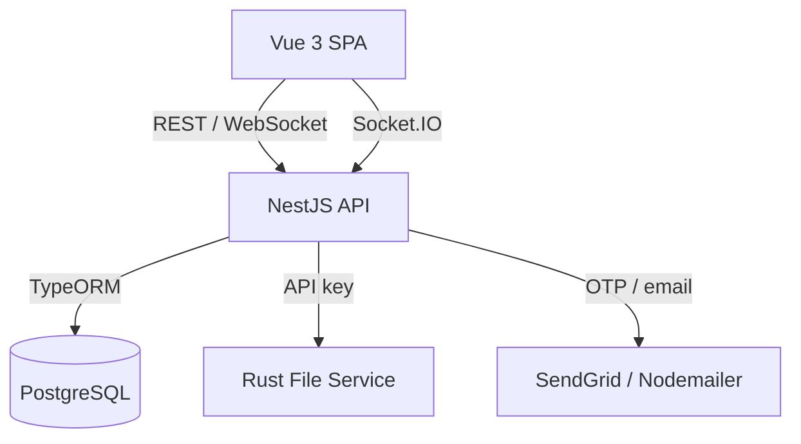

# FirstStep — Student Part-Time Job Portal
### Presentation Content for Figma Slides (Group 12)

> How to use this file: each "Slide" block below maps to one Figma slide.
> Copy the **Title** into the slide heading, the **Body** into the content area
> (bullets), and keep the **Speaker notes** in Figma's "Notes" panel (bottom bar).
> Design tips at the bottom help you keep the deck consistent.
> Target length: 18 slides (fits your ~15–20 range).

---

## Slide 1 — Title

**Title:** FirstStep — A Student Part-Time Job Portal

**Body:**
- Connecting students with part-time jobs, employers, and a community feed
- Group 12 · Project II
- Web App · NestJS · Vue 3 · PostgreSQL · Rust

**Speaker notes:** Introduce the team and the one-line pitch: a platform where students build a profile, discover part-time work, and engage in a social feed, while employers post and get verified, and admins moderate.

---

## Slide 2 — The Problem

**Title:** The Problem

**Body:**
- Students struggle to find legitimate, flexible part-time jobs that fit study schedules
- Job listings are scattered and hard to filter by skills, availability, or salary
- Trust is low: fake employers and scams are common
- No single place to manage a profile, CV, applications, and updates

**Speaker notes:** Frame the pain points from the student's perspective and from the employer's perspective (reaching the right candidates). This sets up why our platform exists.

---

## Slide 3 — Our Solution

**Title:** Our Solution — "FirstStep"

**Body:**
- One portal for students, employers, and admins
- Student profiles with CV upload and skills
- Employer profiles with verification (anti-scam)
- Admin moderation for trust and safety
- A social-style feed (posts & stories) to build community

**Speaker notes:** Emphasize the three roles and the trust layer (employer verification + admin moderation). The social feed differentiates us from a plain job board.

---

## Slide 4 — Target Users / Roles

**Title:** Three Roles

**Body:**
- **Student** — builds profile, uploads CV, discovers jobs, applies, posts
- **Employer** — creates company profile, gets verified, posts jobs, reviews applicants
- **Admin** — verifies employers, moderates content, handles disputes

**Speaker notes:** Walk through each role's main goal. Mention that role selection happens at registration and drives the onboarding flow.

---

## Slide 5 — Key Features (Overview)

**Title:** Key Features

**Body:**
- Secure authentication (password + passkeys/WebAuthn + OTP email)
- Student onboarding & profile (university, major, skills, CV, salary)
- Employer profiles + admin verification workflow
- Social feed: posts, stories, follows, messages
- File service for CVs, logos, and media
- Admin moderation dashboard

**Speaker notes:** This is the "menu" slide. Tell the audience you'll go deeper on auth, the feed, employer verification, and architecture in the next slides.

---

## Slide 6 — System Architecture

**Title:** System Architecture

**Body:**
- **Frontend:** Vue 3 + Vite + Pinia + Vue Router + Vue I18n
- **Backend:** NestJS (TypeScript), modular structure
- **Database:** PostgreSQL via TypeORM
- **File Service:** standalone Rust (Axum) microservice
- **Delivery:** Docker / docker-compose, container images on GHCR

**Speaker notes:** Explain it's a monorepo with separate workspaces (backend, frontend) plus the Rust file service and shared data_transfer DTOs. Use the diagram on the next slide to show the request flow.

---

## Slide 7 — Architecture Diagram

**Title:** How It Fits Together

**Body:** (recreate this as boxes/arrows in Figma)
- Browser (Vue SPA) → NestJS API → PostgreSQL
- NestJS API → Rust File Service (uploads, downloads, streaming)
- NestJS API → Email/OTP (SendGrid / Nodemailer)
- Real-time: Socket.IO gateway for notifications/messages

**Speaker notes:** Describe the flow: the Vue app talks to the NestJS API; the API persists to Postgres and delegates file storage to the Rust service. Mention WebSockets for live updates.

---

## Slide 8 — Tech Stack

**Title:** Technology Stack

**Body:**
- **Frontend:** Vue 3, Vite, Pinia, Vue Router, Vue I18n, Tailwind Typography
- **Backend:** NestJS 11, TypeORM, class-validator, Socket.IO
- **Auth:** bcrypt, JWT, SimpleWebAuthn (passkeys), express-session
- **File Service:** Rust, Axum, Tokio
- **Database:** PostgreSQL
- **DevOps:** Docker, docker-compose, GitHub Container Registry

**Speaker notes:** Justify a couple of choices: NestJS for a clean modular backend, Vue for a reactive SPA, and Rust for a fast, safe file/streaming service.

---

## Slide 9 — Authentication & Security

**Title:** Authentication & Security

**Body:**
- Email/phone registration + login
- Passwords hashed with bcrypt
- JWT issued on register/login/passkey login
- Passkeys / WebAuthn (passwordless biometrics)
- OTP email verification & secure-account recovery
- Hybrid JWT + session support

**Speaker notes:** Highlight passkeys as a modern, phishing-resistant login. Be honest that auth is being standardized and role-based guards are still being hardened.

---

## Slide 10 — Student Experience

**Title:** Student Experience

**Body:**
- Guided onboarding at `/onboarding/student`
- Profile: university, major, year, skills, bio, job type, availability, salary
- Optional CV upload (multipart)
- Profile page with avatar, stats, education, and post gallery
- Settings: edit info, register passkeys, change password

**Speaker notes:** Walk through what a student does after signup. Mention the CV is stored via the file service and referenced by URL.

---

## Slide 11 — Social Feed (Posts & Stories)

**Title:** Community Feed

**Body:**
- Create posts with title, Markdown content, optional image
- Home feed loads latest posts with loading/empty/error states
- Live Markdown preview when creating a post
- Stories, follows, and direct messages modules
- Entities for likes, comments, shares, bookmarks (data model ready)

**Speaker notes:** This is what makes FirstStep more than a job board — students and employers build a presence. Note pagination and full like/comment UI are planned next.

---

## Slide 12 — Employer Experience

**Title:** Employer Experience

**Body:**
- Company profile: name, industry, description, website, logo
- Proof/patent document upload for legitimacy
- `isVerified` flag drives trust badge
- Verification reviewed by admins before going live
- Roadmap: job posting, applicant tracking, contact reveal

**Speaker notes:** Emphasize the verification gate prevents scams. Be transparent that employer self-service onboarding UI and job posting are upcoming.

---

## Slide 13 — Admin & Moderation

**Title:** Admin & Moderation

**Body:**
- Admin dashboard at `/admin/moderation`
- List pending employers · approve · reject
- Proof-review modal with review metrics
- Endpoints: `GET /admin/employers/pending`, `PATCH .../approve`, `DELETE .../reject`
- Roadmap: post/job moderation, dispute handling, admin-only guards

**Speaker notes:** Show how trust is enforced operationally. Mention the moderation route still needs role-based protection (known follow-up).

---

## Slide 14 — File Service (Rust)

**Title:** Dedicated File Service (Rust)

**Body:**
- Standalone Axum microservice for media (CVs, logos, images)
- API-key protected (`x-api-key` / Bearer)
- Upload (multipart), download, list media
- Streaming with HTTP range requests (video/large files)
- Configurable storage root + upload size limits

**Speaker notes:** Explain why we separated file handling: performance, safety, and streaming. Range-request support means efficient media playback.

---

## Slide 15 — Data Model Highlights

**Title:** Data Model

**Body:**
- Users + role/account-status enums
- Student profile & Employer/company profile
- Posts (+ likes, comments, shares, bookmarks), Stories
- Follows, Messages, Job applications
- Auth: sessions + passkey credentials
- Shared `data_transfer` DTOs between frontend & backend

**Speaker notes:** Point out the shared DTO package keeps the API contract consistent across frontend and backend. TypeORM auto-loads entities.

---

## Slide 16 — Live Demo

**Title:** Demo

**Body:**
- Register → choose role → onboarding
- Create & view a post in the feed
- Employer submits company proof
- Admin approves the employer
- (Optional) Passkey login

**Speaker notes:** Keep the demo to 3–4 minutes. Pre-seed accounts so you can jump straight to the admin approval moment — it's the most compelling part.

---

## Slide 17 — Challenges & What We Learned

**Title:** Challenges & Learnings

**Body:**
- Standardizing auth (JWT vs session) and adding role-based guards
- Designing a trustworthy employer-verification flow
- Integrating a polyglot stack (TS + Rust) cleanly
- File storage and media streaming done safely
- Coordinating work as a team in a monorepo

**Speaker notes:** Be genuine about trade-offs. This shows growth and engineering maturity to the evaluators.

---

## Slide 18 — Roadmap & Closing

**Title:** Roadmap & Thank You

**Body:**
- Job posting + searchable, paginated job discovery
- Application tracking (Submitted → Viewed → Interview → Result)
- Likes/comments UI, feed pagination
- Bilingual English/Khmer localization
- Production hardening: role guards, secure file storage, tests
- **Thank you! Questions?**

**Speaker notes:** End with the vision: complete the MVP job flow, then add smart job recommendations and skill matching (Phase 2). Invite questions.

---

## Design Tips for the Figma Deck

- **Theme:** pick 2 brand colors (e.g., a deep blue + a warm accent) and 1 neutral; reuse on every slide.
- **Fonts:** one font for headings (bold), one for body; keep heading size consistent.
- **Layout:** big title top-left, 4–6 short bullets max per slide — never paragraphs.
- **Icons:** use Figma's icon plugins (e.g., Iconify) for role/feature icons.
- **Diagrams:** rebuild Slide 7's flow as simple boxes + arrows; label arrows ("REST", "API key").
- **Screenshots:** add real UI screenshots on the Student, Feed, Employer, and Admin slides.
- **Consistency:** add slide numbers and a small "FirstStep · Group 12" footer.
- **Contrast:** dark text on light background (or vice versa) — test readability from the back of a room.
