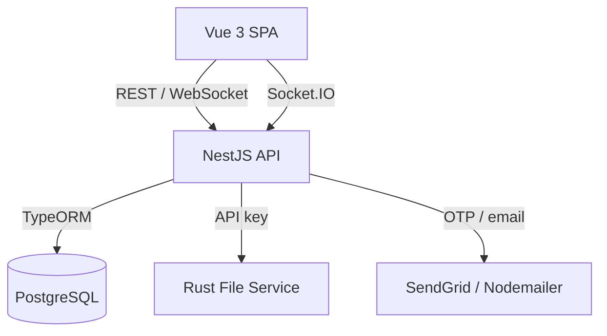

# FirstStep — Student Part-Time Job Portal

> Group 12 · Project II — A web platform that connects students with part-time jobs,
> employers, and a social community feed.

FirstStep is a full-stack monorepo application. Students build a profile and CV,
discover and apply to part-time work, and engage in a social feed (posts, stories,
follows, messages). Employers create verified company profiles, and admins moderate
content and approve employers to keep the platform trustworthy.

- **Website** : https://firststep.cottonsofficial.com
- **Presentation Slide** : https://presentation.cottonsofficial.com
- **Weekly Reports** : https://report.cottonsofficial.com

---

## Table of Contents

- [Features](#features)
- [Architecture](#architecture)
- [Tech Stack](#tech-stack)
- [Project Structure](#project-structure)
- [Getting Started](#getting-started)
  - [Prerequisites](#prerequisites)
  - [Environment Variables](#environment-variables)
  - [Run Locally](#run-locally)
  - [Run with Docker](#run-with-docker)
- [Available Scripts](#available-scripts)
- [Services & Ports](#services--ports)
- [Roadmap](#roadmap)

---

## Features

- **Three roles** — Student, Employer, and Admin, each with its own onboarding flow.
- **Authentication & security** — email/phone registration, bcrypt-hashed passwords,
  JWT, passkeys / WebAuthn (passwordless login), OTP email verification, and
  session support.
- **Student experience** — guided onboarding, profile (university, major, skills,
  bio, availability, salary), and optional CV upload.
- **Social feed** — create posts with Markdown content and images, stories, follows,
  and direct messages.
- **Employer verification** — company profiles with proof-document upload and an
  `isVerified` trust badge gated by admin review.
- **Admin moderation** — dashboard to review, approve, and reject pending employers.
- **Dedicated file service** — standalone Rust microservice for CVs, logos, and
  media with API-key auth and HTTP range streaming.

---

## Architecture



The Vue SPA talks to the NestJS API, which persists data to PostgreSQL via TypeORM
and delegates file storage/streaming to the standalone Rust (Axum) file service.
Socket.IO powers real-time notifications and messages. Shared DTOs in
`data_transfer` keep the API contract consistent across frontend and backend.

---

## Tech Stack

| Layer        | Technologies |
|--------------|--------------|
| Frontend     | Vue 3, Vite, Pinia, Vue Router, Vue I18n, Tailwind Typography |
| Backend      | NestJS 11, TypeORM, class-validator, Socket.IO |
| Auth         | bcrypt, JWT, SimpleWebAuthn (passkeys), express-session |
| File Service | Rust, Axum, Tokio |
| Database     | PostgreSQL |
| DevOps       | Docker, docker-compose, GitHub Container Registry (GHCR) |

---

## Project Structure

```
job-portal-group-12/
├── backend/          NestJS API (auth, users, posts, applications, stories,
│                     follows, messages, company, reports, admin, notifications)
├── frontend/         Vue 3 single-page application
├── file_service/     Rust (Axum) microservice for file upload/download/streaming
├── data_transfer/    Shared DTOs between frontend and backend
├── db-init/          Database initialization scripts
├── progress_book/    mdBook project progress documentation
├── presentation/     Project presentation site
├── docker-compose.yml
└── package.json      npm workspaces root (backend + frontend)
```

---

## Getting Started

### Prerequisites

- [Node.js](https://nodejs.org/) (18+) and npm
- [PostgreSQL](https://www.postgresql.org/) (or use the Docker setup)
- [Rust](https://www.rust-lang.org/tools/install) (for the file service)
- [Docker](https://www.docker.com/) & docker-compose (optional, for containerized runs)

### Environment Variables

Create a `.env` file in the project root. The backend loads it at startup
(`dotenv/config`). Example keys (replace values with your own):

```dotenv
PORT=3000
SESSION_SECRET=change-me

# Database (PostgreSQL)
DB_HOST=localhost
DB_PORT=5432
DB_USERNAME=postgres
DB_PASSWORD=postgres
DB_NAME=first_step_db

# Email (OTP / notifications)
GMAIL_USER=your-address@gmail.com
GMAIL_PASS=your-app-password

# Rust file service
SHEEP_URL=localhost:3001
SHEEP_API_KEY=change-me
```

> ⚠️ Never commit real secrets. Keep `.env` out of version control.

The file service is configured separately via `file_service/sheep.toml`
(host, port, max upload size, storage directory, and `api_key`).

### Run Locally

Install dependencies from the repository root (npm workspaces):

```bash
npm install
```

Start each service in its own terminal:

```bash
# Backend (NestJS) — watch mode
npm run backend:dev

# Frontend (Vue + Vite)
npm run frontend

# File service (Rust)
npm run file:serve
```

### Run with Docker

Prebuilt images are published on GHCR and orchestrated via `docker-compose.yml`:

```bash
docker compose up -d
```

This starts the backend, frontend, progress book, and presentation containers.

---

## Available Scripts

Run from the repository root (`package.json`):

| Script                          | Description |
|---------------------------------|-------------|
| `npm run backend`               | Start the NestJS backend (production mode) |
| `npm run backend:dev`           | Start the backend in watch/dev mode |
| `npm run frontend`              | Start the Vue frontend dev server |
| `npm run book`                  | Serve the mdBook progress book on port 3080 |
| `npm run file:serve`            | Run the Rust file service |
| `npm run file:build`            | Build the Rust file service |
| `npm run file:build_arm_linux` | Cross-compile the file service for aarch64 Linux |

---

## Services & Ports

| Service              | Local (dev)        | Docker (compose) |
|----------------------|--------------------|------------------|
| Backend API          | `3000`             | `3080`           |
| Frontend             | `5173` (Vite)      | `3081`           |
| File service         | `3001`             | —                |
| Progress book        | `3080`             | `3082`           |
| Presentation         | —                  | `3083`           |

> The backend serves its API under the global prefix `/api`.

---

## Roadmap

- Job posting with searchable, paginated job discovery
- Application tracking (Submitted → Viewed → Interview → Result)
- Likes/comments UI and feed pagination
- Bilingual English/Khmer localization
- Production hardening: role-based guards, secure file storage, and tests

---

_Built by Group 12 for Project II._
