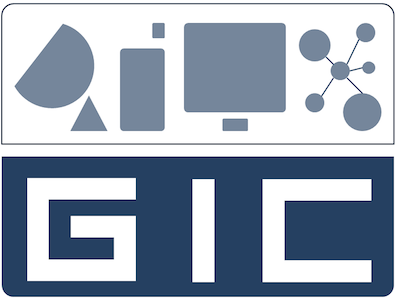

  

    
    

      
ព្រះរាជាណាចក្រកម្ពុជា

      
ជាតិ&nbsp;&nbsp;&nbsp;សាសនា&nbsp;&nbsp;&nbsp;ព្រះមហាក្សត្រ

    

    
  

  

    
Project Report:

    
Student Part-Time Job Portal

  

  
Group 12

  
I4-GIC

  <table class="cover-members">
    <thead>
      <tr>
        <th>Student Name</th>
        <th>ID</th>
        <th>Notes</th>
      </tr>
    </thead>
    <tbody>
      <tr><td>SOK&nbsp;&nbsp;&nbsp;&nbsp;LYPHENG</td><td>e2022……</td><td>……</td></tr>
      <tr><td>SOPHEAP&nbsp;&nbsp;&nbsp;&nbsp;SOTHIPHAK</td><td>e2022……</td><td>……</td></tr>
      <tr><td>CHANTHA&nbsp;&nbsp;&nbsp;&nbsp;MENGKONG</td><td>e2022……</td><td>……</td></tr>
      <tr><td>LUY&nbsp;&nbsp;&nbsp;&nbsp;LYHOR</td><td>e2022……</td><td>……</td></tr>
      <tr><td>CHHON&nbsp;&nbsp;&nbsp;&nbsp;PHEAKDEY</td><td>e2022……</td><td>……</td></tr>
      <tr><td>KEO&nbsp;&nbsp;&nbsp;&nbsp;SIENGHENG</td><td>e2022……</td><td>……</td></tr>
      <tr><td>CHENG&nbsp;&nbsp;&nbsp;&nbsp;SAKDA</td><td>e2022……</td><td>……</td></tr>
    </tbody>
  </table>

  
Lecteur : CHUN Thavorac

  
Year 2025-2026

